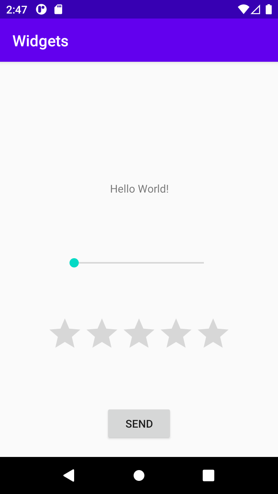

**Jag började med att skapa en constraint layout där jag ändrade storleken för att passa layouten jag ville skapa, eftersom den 
ligger innuti en anna constraint layout binde jag den till botten och sidorna av förälder layouten samt botten av textViewen, sedan 
flyttade jag "hello world" texten uppåt eftersom det fanns så mycket extra plats.
Som min första widget skapade jag en knapp som constrainas med botten och sidorna av layouten jag skapade. Min andra widget var en 
SeekBar som constrainas till toppen och sidorna av min layout. Sedan för den sista widgeten skapade jag en RatingBar som constrainas 
med sidorna av min layout samt botten av SeekBar och toppen av Button, jag gjorde även så botten av Seekbar constrainades till 
toppen av RatingBar.
Slutligen ändrade jag texten på min knapp genom att byta ut rena texten med en string jag skapade. **